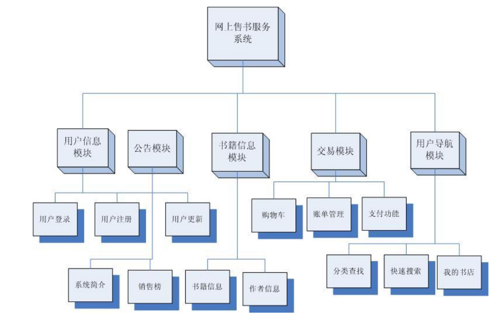

# 第3章：业务逻辑分析和功能模块划分

## 业务逻辑分析

### 业务逻辑概述

网上书店这种业务形式属于电子商务的范畴，虽然它对现在人们来说并不陌生，并且很多人对它已经有了很深切的亲身体验。但是要把它完全说清楚并不是一件很容易的事情，还得从电子商务本身的概念和当今市场的发展情况说起......

所谓电子商务，其实是相对现在传统的商务模式的一种扩展，一种市场销售手段的更新，它的形式很多，但从目前的情况来看，电子商务的应用主要存在着 B2B 和 B2C 两种模式，其中 B2B 全称 Business to Business，主要是企业之间的商务交易，规模较大，业务逻辑也相对复杂很多，如国内的阿里巴巴网站(http://china.alibaba.com/) 就在此类，但它不属于本系统的要研究范围。

B2C 全称 Business to Customer，它直接面向普通消费者，从目前的市场情况来看，它的业务模型主要有两种，一种类似超市，物品种类众多，交易量惊人，业务相对比较复杂，维护成本很大，这类网站比较少，如淘宝网(http://www.taobao.com/)、当当网(http://www.dangdang.com/)大致可算此类;另一种如同超市中的物品专柜，物品种类和交易量相对较小，业务逻辑也较为简单，如亚马孙书店(http://www.amazon.com/)、中国互动出版网(http://www.china-pub.com/)正是这种
情况。

本系统的业务逻辑就是采用 B2C 的第二类模式，应该实现消费者的系统的注册和登录，并可以自由的查看商品、挑选商品、然后购买结帐等功能。具体的系统流
程如下图所示:

### 系统流程图

```Mermaid
graph TD
    id1((用户)) --访问--> id2((导航栏))
    subgraph 书籍销售系统
        id2 --分类或搜索--> id3{查看图书信息}
        id2 --如果没有登录--> id4{用户登录}
        id2 --如果已经登录--> id5{查看交易记录}
        id2 --如果已经登录--> id6{查看购物车}
        id3 --加入采购清单--> id6
        id4 --登录成功--> id3
        id4 --登录成功--> id6
        id5 --支付未完成的交易-->id7((支付平台))
        id6 --立即购买--> id7
        id6 --延后付款--> id5
    end
```

### 系统功能的详细描述

系统的功能应该满足给一个用户这样的流程体验:首先，一进入书店(即访问
首页)，就应该让用户对系统立刻有一个基本的感性认知。在首页上应该包括对系统的简介、公告、销售排行榜、用户登录、用户注册、导航栏以及搜索工具等，并且通过导航栏用户可以按照自己的意愿查看图书，并随着各种连接自由的跳转着查看各种信息，用户登录后，在浏览图书和其他各种信息的时候应该实时同步显示购物车的信息，要让用户随时都能从购物车中增删书籍并去服务台结帐的方便体会，而且，在导航栏中应该在原有的基础上增加类似“我的书店”样一种系统注册用户特有的功能，可以方便用户更改查看购物车，帐单。用户本人信息等功能入口，在用户确认帐单并支付后，应该写入该用户相关的信息，并清空购物车，激活帐单，为下一轮购物做好准备。总之，对这类网站必须尽可能的利用有限的空间，提供尽可能多的关联信息，以得到比较好的用户体验，在保证系统的正确运行的前提下，方便取悦用户应该得到很大的重视。

## 功能模块划分

了解了业务逻辑，就可以进入具体的功能设计了，对于一个工程项目而言，模块的划分设计直接关系到后期的编码复杂度，如果模块之间的耦合太紧，就会导致代码的混乱，各种生存期变量夹杂在一起，可读性和可维护性大大削弱，尤其对 ASP这种 script 语言来说，因为不存在编译时刻的类型检查， 导致在运行时出现不可预测的错误可能性大大增多。因此，这个阶段的工作应该给予足够的重视。

### 模块目录

根据上面业务逻辑的分析和功能的详细描述，本着模块之间达到松耦合的设计
原则，本系统的层次模块划分可以如下图所示:



## 系统的文件目录

一个工程项目的文件目录结构应该和该系统的模块层次划分存在某种较为严格的对应关系，因此，根据上面的模块层次方框图，本系统的目录结构如下图所示:

下面详细说明各目录的情况:见表三-1:

                    表 三-1 系统文件目录一览表
      目录名                         说 明
       Books    包括书籍列表、销售榜、书籍详细信息和作者信息四部分。
        Cart    购物车功能模块，包括购物车的增加、删除、清空等功能。
      Clientlib 客户端公用脚本文件，内含各 javacript 全局代码，以备调用。
        Lib     服务器公用脚本文件，内含各 vbscript 全局代码，，以备调用。
         Db     数据库文件存储目录。
      Dgserver  服务台功能模块，包括用户的建立、激活帐单及结帐等功能
        Img     网站图片存储目录。
     Stylesheet 站点公用样式存储文件。
       Users    用户功能模块，包括用户的注册、登录、找回密码及更新功能。
       Orders   帐单的查询功能模块，显示用户注册以来所有被激活的帐单。
    因为这里只是设计，并没进入具体的操作阶段，具体的文件结构建立工作将会
在系统的发布部分作详细的介绍，所以这里先不作描述。
(3) 各模块实现技术选择
    B/S 类型的项目最大的麻烦就在于如何分配客户端和服务器端的任务，决定那
些应该在客户端完成，那些应该由服务器来完成，并且如何实现两者之间的通信问
-                        三-- 15 -
题，这直接关系到网站的性能以及一些安全问题，取舍之后才能根据面对的问题选
择相应的技术。
    首先，客户端应该完成对客户输入的合法性进行检查，尽量把非法输入拒绝在
客户端以减轻服务器的安全和计算两方面的压力。这方面，.NET 有着一整套完整的
检验控件，使用起来极其方便，而在 ASP，编程人员只能自己在客户端编写 javascript
代码以检查用户的各种输入，尽管.NET 控件也是通过封装了脚本来实现的，但就编
程效率来说，二者就不能同日而语。
    接着，看看服务器端的情况，服务器端的程序要完成数据库的各种查询，并维
护数据安全等问题，数据库连续的情况是整个系统的性能瓶颈所在，脚本编程的不
足在这些地方(包括对内存的控制、数据库访问的方式、程序异常处理等方面)得
到了充分的体现，但是出于本系统的目的我们这里还是选择了 ASP+ADO 作为系统
服务器端处理技术。
最后，考虑下客户端和服务器的信息通信问题，一般情况下，客户浏览器提交信息
给服务器的方式由两种:URL 参数和表单(Form)提交，其中 URL 参数是指在文
件 URL 后面之间加入参数，放在 URL 的后面以“?”开始。如:
    http://www.lingjie.net/bookshop/books/booklist.asp?type=Csharp
上面的 type 就是 booklist.asp 文件接受的参数，值为“Csharp”。这种方式尽管方便，
但有很大的安全问题，特别是文件中的数据处理直接需要使用该数据的时候，一些
不怀好意的人会在 URL 参数中直接输入部分 sql 语句，导致数据操作的严重错误，
包括数据被更改或者丢失，这种方式大大增加了服务器端对数据检查的压力，但是
ASP 的编程中几乎不得不大量使用这种方式，而在.NET 中，可以利用各种控件的事
件触发机制，把参数直接递交给已经编译好的有着强大类型检查功能的 dll 文件，可
以很顺利的解决这类问题。
     表单(Form)方式是指根据一系列用户的明文输入，作为一个整体提交给服务
器，比如用户登录界面。这种方式可以用上面提到的客户端检查来检测非法输入，
相对比较安全，但是在使用方式上有着明显的限制，当然，在.NET 中由于大量后台
控件的引入和强大的类库支持，表单的作用得到了空前的扩展。
     然而，从服务器到客户端的通信，对 ASP 来说几乎只有 cookie 方式。当然，如
果选择.NET，选项将远远多于前者。
     通过上面技术选择的分析，两种技术的差异已经得到了初步的体现，但这种比
较是否具有这两种技术所代表的技术类型的普遍特点呢?我将在第四部分为什么选
择 ASP 的论述中作进一步的分析。
(4) 各模块存在的源文件
    这里交代一系列源码清单，以便查询，具体如表三-2 所示:
-                                    三-- 16 -
          表 三-2 功能模块和源文件对应表
  模块名                          对应源文件
       注册:regusr.asp/savereg.asp;
       更新:usrmsg.asp/update.asp
  用户信息 登录: login.asp/islogin.asp
       找回密码:        getpwd.asp
       注销登录: delsession.asp
       系统简介:defmsg.asp
  系统公告
       销售排行:       top.asp
       书籍列表:booklist.asp
  书籍信息 书籍详情:bookmsg.asp
       作者信息:authormsg.asp
       购物车功能:addcart.asp/deletecart.asp/showcart.asp
  用户交易 帐单功能:makeorder.asp/saveorder.asp/showorder.asp
       支付功能:hadbuy..asp
       快速搜索:nav.asp
  导航系统 查看图书:nav.asp
       我的书店:nav.asp
