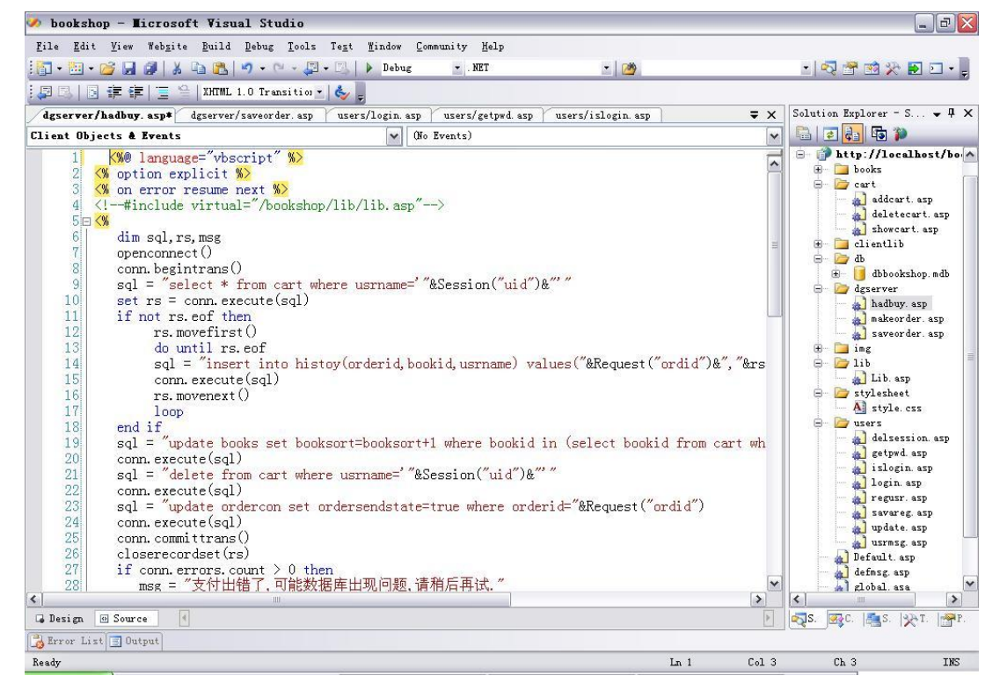
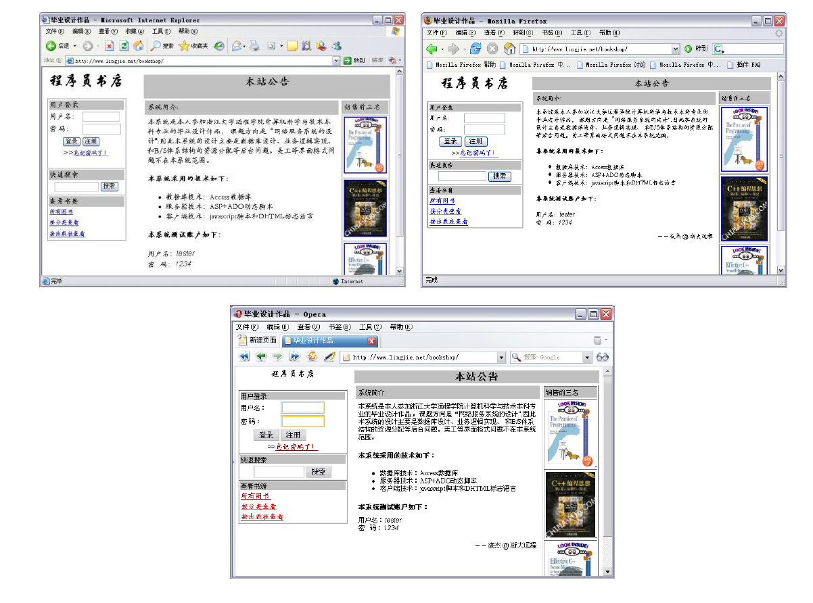

# 第4章： 开发工具与环境选择

到目前为止，系统设计阶段已经结束了，但是在进入编码阶段之前，必须把选择的工具与环境以及选择的原因作应该必要的交代，我将按照下面两个方面作一个详细的描述。

## 服务器技术选择

### 为什么选择 ASP ？

正如第一部分交代的那样，本系统的设计目的除了完成这个项目的业务逻辑之外，还需要通过与.NET 技术进行比较，讨论这种所谓的 Web2.0 的编译型编程方式带来进步意义。但是服务器脚本有很多种，比如 JSP、PHP 等等，为什么单单以 ASP 为代表呢?我个人认为主要因为两点:

- 第一，对于 windows 系统来说，ASP 几乎不需要任何额外的支持，只需要 windows 自带的 IIS 即可，选择它方便系统的发布。
- 第二，就和..NET 的比较而言，ASP 和 ASP.NET 存在某种血缘关系，可比性多。进步也较为明显。

因此，选择 ASP 作为脚本 web 编程的代表对于本系统的设计目标是合适的，并且也是足以胜任的。

### 为什么选择 ADO ？

数据库连接程序作为一种中间件，它的选择往往是由目标程序的编写方式决定的，既然选择了 ASP，就没道理不选择它的最佳搭档作为数据库连接程序。何况他的连接方式也普遍反映了这种编程方式的数据库处理方式。

### 为什么选择 Access ？

对于本系统来说，数据库不是主要的问题，我们只是需要一个功能完善，操作简单，便于移植的数据库，结合这些特点，Access 无疑是最佳选择。

### 为什么选择 windows 下的 IIS ？

就目前的市场而言，http 监听程序主要是 apache 和 IIS 平分天下，尽管前者占有量较大，而且各种操作系统都有版本，但对 ASP 的支持不够好，而且需要安装很多组件，给发布工作带来很大的麻烦，而 IIS 有 windows 自带，无需耗费多少精力。

### 为什么选择 Visual Studio 2005 集成开发环境？

对于脚本编程来说，运行时的调试是一个很大的麻烦，微软最近推出的 VS2005 集成开发环境里有一个专门用于 web 开发的组件，如下图所示:

它可以直接把项目建在 IIS 上，可以很方便的跟踪、调试、修改，另外它的 copy web site 功能可以很方便的对远端的发布版本进行修改和覆盖。

## 客户端技术选择

### 为什么使用 Javascript ？

从目前的市场来看，虽然客户端技术发展很快，但其中最普遍使用的，最标准化的客户端编程技术还是 javascript，尽管它也存在一定的浏览器兼容问题，但相比其他技术要好很多，它也能通过 HTML 的 DOM 模型，是 web 页面具有一定的交互能力。因此，我认为以 javascript 作为主要的客户端技术是适当的。

### 为什么使用 Cookie ？

正如上面模块技术选择分析中指出的那样，在 ASP 方式下，服务器脚本能传给客户端脚本信息的方式几乎只有那么一种，但在很多情况下这种传递是必须的，尽管它有一定的安全隐患，但总体来说，cookie 还是一种很有用的技术。

### 为什么要作跨浏览器的考虑？

对于 B/S 编程方式来说，最明显的特点就是，服务商在服务器端提供各种服务，而不限制客户在客户端用什么浏览器访问该服务。现在有些人认为 ASP 的网站只能用 IE 来访问，这是不对的，严格来说，它只在服务器端要求了微软技术的支持，而它发送到客户端的应该只是 javascript 和 HTML，几乎所有的浏览器都支持这两种技术的，当然现在很多这种网站被要求在客户端安装 ActiveX 组件，这才是导致这些站点只能被 IE 浏览的主要原因。

本系统经过测试，至少当今主流的 IE、firefox、opera 三大浏览器是完全可以使用系统提供的服务的。下面分别是三种浏览器访问本系统的图片。

