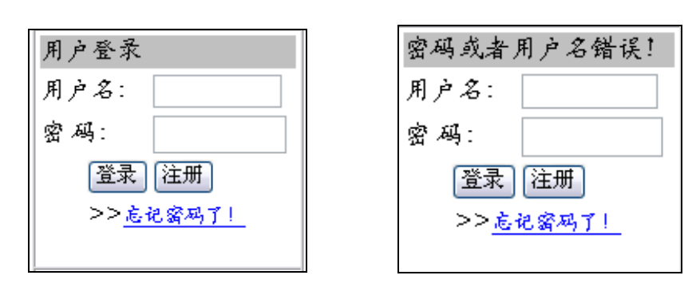
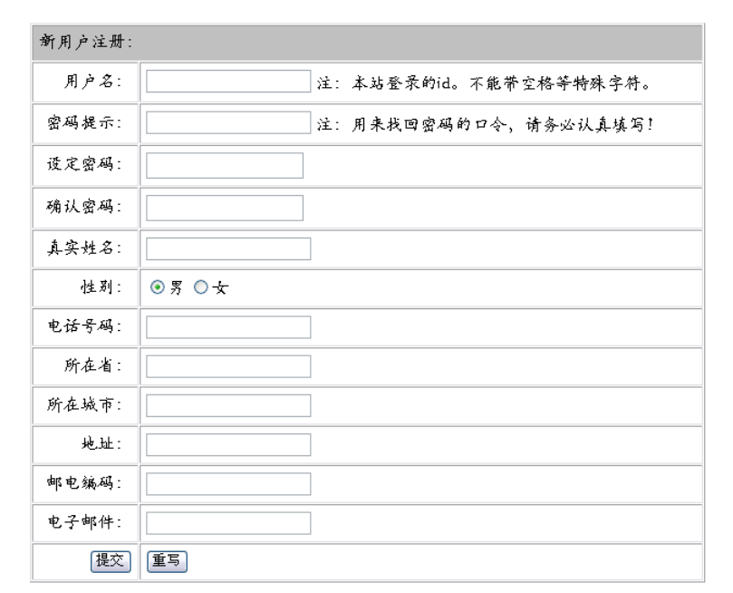
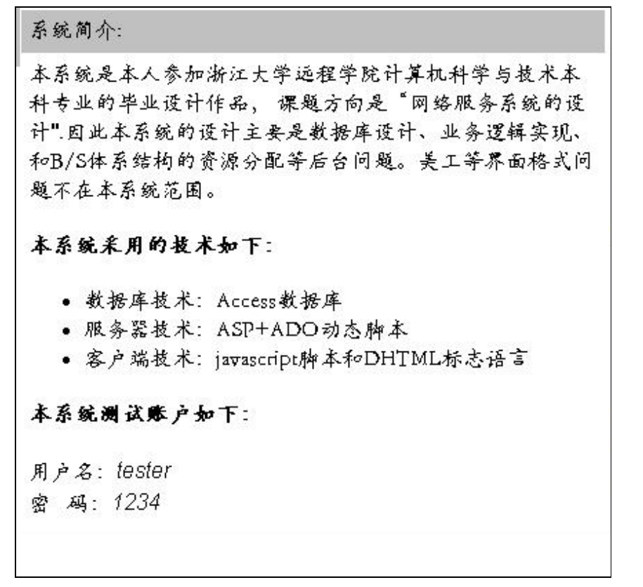
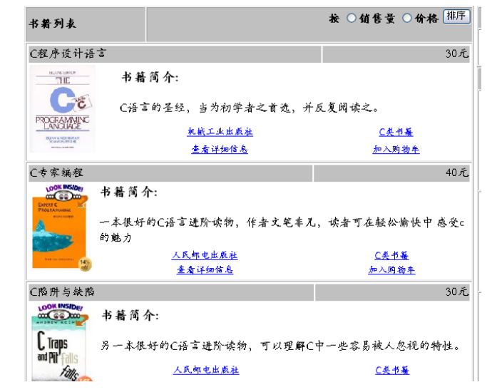
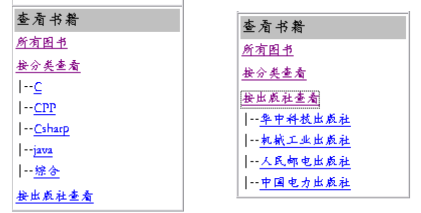
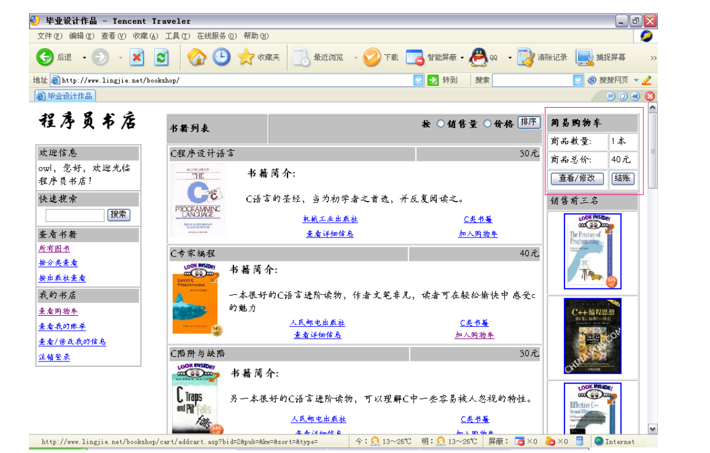
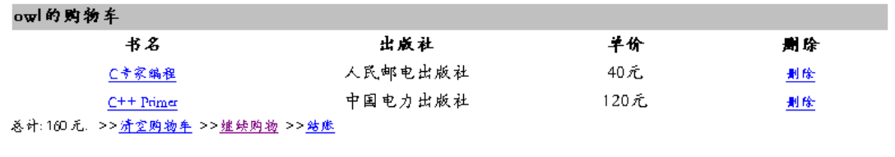

# 第5章： 各功能模块的实现

现在，我们可以进入系统的实际编码阶段了。在具体的编码过程中，系统的设计已经不是它的主要问题，这也是为什么前面花了这么多篇幅详细介绍设计的原因。如果没有这些设计编码的工作就无从开展，而真正到了编码阶段，编程人员要面对的就是一些细节问题了，它们包括函数和变量的作用范围、代码的可重用性、可读性及其可维护性。这些问题特别对于脚本编程来说,不是件很容易的事情。下面我们详细描述本系统的各部分实现。

## 全局作用的函数和变量

出于程序编写的需要，肯定需要一些在整个系统中都能使用的函数和变量，它们应该不受所在页面的使用限制。

### 全局变量的定义和初始化

对于Web应用程序来说,全局变量有两种,一种叫应用程序级变量,它对于所有的访问用户都只维护一个实例;另一种叫会话级变量,它对每一个访问用户维护一个对应的实例,这两种变量一般而言都定义系统的一个叫`global.asa`的文件中,该文件在系统第一次被运行(第一个访问来到的时候)时加载 。具体代码如下所示:

```ASP
<object runat="server" scope="Session" id="conn"
        progid="adodb.connection" VIEWASTEXT>
</object>                        ‘一个用户对应一个数据连接实例

<script language="vbscript" runat="server">
    sub Session_OnStart
        session("uid") = ""          ‘存储用户名
        session("logfail") = false   ‘表示是否登录
    end sub

    sub Session_OnEnd
        session("uid") = ""
        session("logfail") = false
    end sub

    sub Application_OnStart
        Application("strConnect") =
            "Provider=Microsoft.Jet.OLEDB.4.0;Data Source="_
            &Server.MapPath("db/dbbookshop.mdb")&_
            ";Persist Security Info=True"
                                    ‘此为连接字符串,所有用户公用
    end sub
</script>
```

其中，`conn`、`session`集合中的所有变量均为会话级变量,由访问用户各自所有，互不影响，而`Application`集合的变量为应用程序级变量，为所有用户共享。这里的连接字符串作为连接数据库连接路径、类型、和权限的参数，对所有的用户都是相同得，因此只需维护它的一个实例即可。

### 函数库的声明

函数按其调用方式，可分为两种：第一，被叫做事件处理函数，是指按照一定的约定,当某种系统操作被激活时,系统会自动调用相应的函数,就全局事件函数而言，一般也写在 global.asa,在上面的代码中的 Session_OnStart、Session_OnEnd、和 Application_OnStart 三个函数就分别在会话建立。撤销和系统载入时被自动调用的;第二,被叫做自定义函数, 把复用程度高的代码写成函数,用的时候直接调用即可,这里函数我写在 lib.asp 文件中,代码如下所示:

```ASP
<script language="vbscript" runat="server">
    '打开数据库连接
    sub openConnect()
        Conn.Open(Application("strConnect"))
    end sub
    '关闭数据库连接
    sub closeConnect()
        Conn.Close()
    end sub
    '关闭Recordset并释放资源
    sub closeRecordset(rs)
        rs.Close()
        set rs = nothing
    end sub
</script>
```

然后在需要调用这些函数的页面中输入该指令:

```ASP
<!--#include virtual="/bookshop/lib/lib.asp"-->
```

即可将其引入当前文件并使用之。

## 用户模块

### 用户登录

这个功能实现分为下面两个部分:

第一部分是浏览端的界面显示和数据检查,详细代码如下:

首先是界面显示,其主要代码如下:

```ASP
<form name="usrlog" action="/bookshop/users/islogin.asp" method="post" onsubmit="return logsubmit()">
    <table width="100%" border="0" cellpadding="0" cellspacing="3">
        <tr><td bgcolor=Silver colspan="2">
        <%
            if session("logfail") then
                Response.Write("密码或者用户名错误!")
            else
                Response.Write("用户登录")
            end if
            session("logfail") = false
        %>
        </td></tr>
        <tr>
            <td>用户名:</td>
            <td><input type="text" name="name" id="name" size="10"   /></td>
        </tr>
        <tr>
            <td>密 码:</td>
            <td><input type="password" name="pass" id="pass" size="10"   /></td>
        </tr>
        <tr>
            <td align="right"><input type="submit" name="submit" value="登录" /></td>
            <td><input type="button" value="注册"
                onclick="javascript:navto('/bookshop/users/regusr.asp','main')" /></td>
        </tr>
        <tr><td align="center"colspan="2">
            >><a href="/bookshop/users/getpwd.asp" target="main">忘记密码了!</a></td>
        </tr>
    </table>
        </form>
    <% else %>
        <table width="100%">
            <tr><td bgcolor=Silver>欢迎信息</td></tr>
            <tr><td>
                <%=Session("uid") %>,您好,欢迎光临程序员书店!
            </td></tr>
    </table>
    <% end if %>
```

其结果,如图所示(两种状态):



接下来是客户端的数据检查,正如上面代码所示,表单在提交前触发客户端的 onsubmit 事件,调用一个 javascript 函数,代码写在 clientlib.js 文件中:主要代码如下:

```javascript
function logsubmit(){
    var frm = document.usrlog;
    if(frm.name.value == ""){
        alert("用户名不能为空!");
        frm.name.focus();
        return false;
    }
    if(forsql(frm.name)==false)
    return false;
    if(frm.pass.value == ""){
        alert("请输入密码!")
        frm.pass.focus();
        return false
    }
    if(forsql(frm.pass)==false)
        return false;
    return true;
}
function forsql(idname){
    if(idname.value != "")
    if(idname.value.indexOf("\'") != -1) {
            alert("非法字符,请重新输入!");
            idname.focus()
            return false;
    }
    return true;
}
```

第二部分就是后台的登录验证了,代码如下所示:

```ASP
<%@ language="vbscript" %>
<% option explicit %>
<!--#include virtual="/bookshop/lib/lib.asp"-->
<%
    dim sql,rs
    dim susr,spwd
    dim msg
    susr = Request.Form("name")
    spwd = Request.Form("pass")
    if susr = "" or isnull(susr) or spwd = "" or isnull(spwd) then
        Session("logfail") = true
    else
        openconnect()
        sql = "select usrid from users where usrname='"&susr&"' and usrpwd='"&spwd&"'"
        set rs = conn.execute(sql)
        if not rs.eof then
            Session("uid") = susr
            Session("logfail") = false
        else
            Session("logfail") = true
        end if
        closeconnect()
    end if
    Response.Redirect("/bookshop/nav.asp")
%>
```

### 用户注册

这个功能同样也分两部分描述:

客户的界面刻画和数据检查方式与完全完全相同,只是输入的项目增多而已,代码这里就不重复描述了,得到效果如下图所示：



接下来自然是注册信息在服务器端的写入了,代码如下所示:

```ASP
<%@ language="vbscript" %>
<% option explicit %>
<!--#include file="../lib/lib.asp"-->
<%
dim useid, usename, pass, addm, state, city, email, zip, usertype, msg
dim key, sex, tel,
dim selectcmd, insertcmd,rs
msg = ""
useid = Request.Form("id")
usename = Request.Form("uname")
pass = Request.Form("pw")
add = Request.Form("add")
state = Request.Form("state")
city = Request.Form("city")
email = Request.Form("email")
zip = Request.Form("zip")
usertype = 1
key = Request.Form("pwdkey")
sex = Request.Form("sex")
tel = Request.Form("tel")
‘定义并初始化各变量
openConnect()
    '检查昵称是否重复
    selectCmd = "select count(*) from users where usrname = '"&useid&"'"
    set rs = Conn.Execute(selectCmd)
    if rs(0) > 0 then
        msg = "对不起,你的用户名已经被注册了,请重新注册!"
    end if
    closeRecordset(rs)
    if msg = "" then
        insertCmd = "insert into users(usrname,usrrealname,usrpwd,usremail,
usraddress,usrzip,usrstate,usrcity,usrlevel,usrsex,usrtel,usrkey)"
        insertCmd = insertCmd&"
values('"&useid&"','"&usename&"','"&pass&"','"&email&"','"&add&"','"&zip&"','"&state&"
','"&city&"',"&usertype&",'"&sex&"','"&tel&"','"&key&"')"
        if Conn.errors.count > 0 then
            Response.Redirect("/bookshop/error/dberror.asp")
        end if
        'Response.Write(insertCmd)
        Conn.Execute(insertCmd)
        msg = "恭喜您!注册成功!请在左边登录界面登录本站。"
    end if
    closeConnect()
%>
<html>
    <head>
        <title><%=msg %></title>
        <link rel="Stylesheet" type="text/css" href="../stylesheet/style.css" />
    </head>
    <body>
        <table align="center" valign="center" width="50%">
            <tr><td colspan="2" bgcolor=Silver>注册结果</td></tr>
            <tr><td colspan="2" align="center" valign="center"><%=msg %></td></tr>
            <tr><td align=center><a href="../defmsg.asp">回首页</a></td>
            <td align=center><a href="regusr.asp">重新注册</a></td></tr>
        </table>
    </body>
</html>
```

### 用户更新

用户更新的界面和数据检查,和注册几乎完全相似,只是在这之前进行了一次查询,并把结果事先写入了编辑框以便修改,代码如下所示:

```ASP
dim selectcmd,rs
openConnect()
selectCmd = "select * from users where usrname='"&Session("uid")&"'"
if Conn.errors.count > 0 then
Response.Redirect("/bookshop/error/dberror.asp")
end if

set rs = Conn.Execute(selectCmd)

<%if not rs.EOF then %>
<form name="reguser" method="post" action="update.asp" onsubmit="return regsubmit()">
<table width="80%" align="center" cellpadding="5" cellspacing="1" border="1" align="center">
<tr><td bgcolor=Silver colspan="2"><%=Session("uid") %>的信息</td></tr>
<tr>
    <td align="right">用户名:</td>
    <td><%=rs("usrname") %></td>
</tr>
<tr>
    <td align="right">密码提示:</td>
    <td><input name="key" id="key" type="text" value='<%=rs("usrkey") %>' /></td>
</tr>
<tr>
    <td align="right">设定密码:</td>
    <td><input name="pw" id="pw" type="password" value="<%=rs("usrpwd") %>"/></td>
</tr>
<tr>
    <td align="right">确认密码:</td>
    <td><input name="repw" id="repw" type="password" value="<%=rs("usrpwd") %>"/></td>
</tr>
<tr>
    <td align="right">真实姓名:</td>
    <td><input name="realname" id="realname" type="text" value="<%=rs("usrrealname") %>" /></td>
</tr>
<tr>
    <td align="right">性别:</td>
    <td><input name="sex" id="sex" type="text" value="<%=rs("usrsex") %>" /></td>
</tr>
<tr>
    <td align="right">所在省:</td>
    <td><input name="state" id="state" type="text" value="<%=rs("usrstate") %>"/></td>
</tr>
<tr>
    <td align="right">所在城市:</td>
    <td><input name="city" id="city" type="text" value="<%=rs("usrcity") %>"/></td>
</tr>
<tr>
    <td align="right">地址:</td>
    <td><input name="add" id="add" type="text" value="<%=rs("usraddress") %>" /></td>
</tr>
<tr>
    <td align="right">电话号码:</td>
    <td><input name="tel" id="tel" type="text" value="<%=rs("usrtel") %>" /></td>
</tr>
<tr>
    <td align="right">邮电编码:</td>
    <td><input name="zip" id="zip" type="text" value="<%=rs("usrzip") %>" /></td>
</tr>
<tr>
    <td align="right">电子邮件:</td>
    <td><input name="email" id="email" type="text" value="<%=rs("usremail") %>"/>
    </td>
</tr>
<tr>
    <td align="right"><input name="submit" id="submit" type="submit" value="更改" /></td>
    <td><input name="reset" id="reset" type="reset" value="重写" /></td>
</tr>
</table>
</form>
<%
    end if
    closeRecordset(rs)
    closeConnect()
%>
```

用户更改后将表单返回给服务器。服务器更新用户数据代码如下所示:

```ASP
updateCmd = "update users set usrcity='"&city&"',usrstate='"_
            &state&"',usremail='"&email&"',usrrealname='"_
            &realname&"',usrzip='"&zip&"',usraddress='"_
            &add&"',usrpwd='"&pass&"',usrtel='"_
            &tel&"',usrkey='"&usrkey&"',usrsex='"_
            &sex&"' where usrname='"&Session("uid")&"'"
Conn.Execute(updateCmd)
```

### 用户找回密码

此部分主要代码和用户登录极其相似,部分代码如下:

```ASP
<%
    dim title,body
    dim selectCmd, mailr
    if Request.Form("key") <> "" and Request.Form("uid") <> "" then
        selectCmd = "select usrpwd from users where usrkey='"_
                    &Request.Form("key")&"' and usrname ='"&Request.Form("uid")&"'"
        title = "恭喜您,密码找到了 "
    openConnect()
    if Conn.errors.count > 0 then
        Response.Redirect("/bookshop/error/dberror.asp")
    end if
    set mailr = Conn.Execute(selectCmd)
    if not mailr.EOF then
        body = "你的密码是:"&mailr("usrpwd")
    else
        closeRecordset(mailr)
    set mailr = conn.execute("select usrid from users where usrname='"&Request.Form("uid")&"'")
        if mailr.eof then
            body = "用户不存在!注册一个吧"
        else
            body = "密码提示错误!您是否记错了?"
        end if
        title = "抱歉,密码没找到!请考虑如下建议。"
    end if
    closeRecordset(mailr)
    closeConnect()
    end if
    if Request.Form("key") = "" then
%>
```

然后根据情况在浏览器中显示查询的结果。

### 用户注销登录

这部分功能,主要有两大任务,一方面要将所有的会话级变量归零;一方面需要把购物车清空,其主要代码如下所示:

```ASP
<%@ language="vbscript" %>
<% option explicit %>
<!--#include virtual="/bookshop/lib/lib.asp"-->
<%
    dim sql
    if Session("uid") <> "" or not isnull(Session("uid")) then
        openConnect()
        sql = "delete from cart where usrname='"&Session("uid")&"'"
        conn.execute(sql)
        Session("uid") = ""
        closeConnect()
    end if
    Response.Redirect("/bookshop/nav.asp")
%>
```

## 公告模块

### 系统公告

这部分没什么程序功能,主要对系统进行了一些介绍,界面如下图所示:



### 销售排行

排行榜功能主要是显示销售情况,具有一定的广告作用,既然为广告,这也就意味着这部分功能的重用率,需要放在一个独立的 ASP 文件中,别处以 include 预处理指令引用之,但是会遇到一个意想不到的麻烦,因为 include 指令只是将所引用的文件简单的替代进当前文件,文件中的变量生存域直接加入了当前域,导致很多变量名字的冲突问题,就连数据库连接变量也因为无法预知引用该部分的代码数据库处理情况,而不得不独自使用一个数据库连接,在.NET 中用户自定义控件对元素的封装能很好的解决此问题,脚本编程的代码一般只能如此:

```ASP
<%
    dim sqltop,rstop,conntop
    sqltop = "select top 3 * from books order by booksort desc"
    set conntop = Server.CreateObject("adodb.connection")
    Conntop.Open(Application("strConnect"))
    set rstop = conntop.Execute(sqltop)
    if not(rstop.eof or rstop.bof) then
%>
<html><body>
        <table width="100%" cellpadding="3" cellspacing="1" border="1">
        <tr><td bgcolor=Silver>销售前三名</td></tr>
        <%
            rstop.movefirst()
            do until rstop.eof
        %>
        <tr><td align="center" valign="middle">
                <a href="/bookshop/books/bookmsg.asp?bid=<%=rstop("bookid") %>">
                    " width="90" height="120" />
                </a></td>
        </tr>
        <%
                rstop.movenext()
            loop
        %>
        </table>
    </body></html>
<%
    end if
    rstop.close()
    conntop.Close()
%>
```

## 书籍模块

### 书籍信息

这部分具体介绍一本书的具体信息,关系到 books 和 authors 的两表查询,因此使用了视图 viewaubk,具体代码主要如下所示:

```ASP
<%@ language="vbscript" %>
<% option explicit %>
<!--#include virtual="/bookshop/lib/lib.asp"-->
<html>
    <head>
        <title>book message</title>
        <link rel="stylesheet" type="text/css" href="../stylesheet/style.css" />
    </head>
    <body>
        <table width="100%">
            <tr bgcolor="silver"><th colspan="2"><h2>书籍信息</h2></th></tr>
            <tr>
                <td width="85%" valign="top">
                    <table width="100%" cellpadding="1" cellspacing="1">
                        <%
                            dim sql,rs
                            dim bid
                            bid = Request("bid")
                            if not(bid = "" or isnull(bid)) then
                                sql = "select * from viewaubk where bookid="&bid
                                openconnect()
                                set rs = conn.Execute(sql)
                                if not rs.eof then
                        %>
                        <tr bgcolor="silver">
                            <td colspan="3"><%=rs("bookname") %></td>
                        </tr>
                        <tr>
                            <td width="30%" valign="middle" align="center" rowspan="3">
                            " />
                            </td>
                            <td align="center">作者</td>
                            <td align="center">
                                <a href="authormsg.asp?aid=<%=rs("books.authorid")%>> <%=rs("authorname") %></a>
                            </td>
                        </tr>
                        <tr>
                            <td align="center">出版社</td>
                            <td align="center">
                                <a href="booklist.asp?pub=<%=rs("bookpub") %>"><%=rs("bookpub") %></a>
                            </td>
                        </tr>
                        <tr>
                            <td align="center">价格</td>
                            <td align="center"><%=rs("bookprice") %>元</td>
                        </tr>
                        <tr>
                            <td colspan="3">
                                <h4>书籍简介:</h4>
                                <p><%=rs("bookcontent") %></p>
                            </td>
                        </tr>
                        <tr>
                            <td align="center" colspan="2">
                                <a href="booklist.asp?type=<%=rs("booktype") %>"><%=rs("booktype") %>类书籍</a>
                            </td>
                            <td align="center">
                                <a href="../cart/addcart.asp?bid=<%=rs("bookid") %>">加入购物车</a>
                            </td>
                        </tr>
                        <%
                                end if
                                closerecordset(rs)
                                closeconnect()
                            else
                        %>
                        <tr><td colspan="2" align="center" valign="top">抱歉,查无此书.</td></tr>
                        <tr>
                            <td align="center">
                                <a href="../defmsg.asp">回首页</a>
                            </td>
                            <td align="center">
                                <a href="booklist.asp">继续购物</a>
                            </td></tr>
                            <% end if %>
                    </table>
                </td>
                <td width="15%" valign="top">
                    <!--#include virtual="/bookshop/books/top.asp"-->
                </td>
            </tr>
        </table>
    </body>
</html>
```

### 作者信息

这部分和书籍信息部分的设计思路几乎完全相同,只是在列出作者信息的同时列出了该作者的主要作品,部分代码如下所示:

```ASP
<%
    dim brs
    sql = "select * from books where authorid="&aid
    set brs = conn.execute(sql)
    if not(brs.eof or brs.bof) then
        brs.movefirst()
        do until brs.eof
%>
<tr>
    <td align="center">
        <a href="bookmsg.asp?bid=<%=brs("bookid") %>&aid=<%=aid %>">
            <%=brs("bookname") %>
        </a>
    </td>
    <td align="center">
        <a href="booklist.asp?pub=<%=brs("bookpub") %>&aid=<%=aid %>">
            <%=brs("bookpub") %>
        </a>
    </td>
    <td align="center">
        <a href="../cart/addcart.asp?bid=<%=brs("bookid") %>&aid=<%=aid %>">
            加入购物车
        </a>
    </td>
</tr>
<%
        brs.movenext()
        loop
    end if
    closerecordset(brs)
%>
```

### 书籍列表

这部分可以说是系统最重要的部分之一,它将接受来自导航部分的各种参数。然后依据这些参数进行查询,因此对参数部分的处理非常重要,代码主要如下:

```ASP
dim pubs,types,keyword,sort
dim sql,rs
pubs = Request("pub")
types = Request("type")
keyword = Request("kw")
sort = Request.Form("sort")
sql = "select * from books "
if not(pubs = "" or isnull(pubs)) then
    sql = sql&"where bookpub='"&pubs&"' " '按出版社查询
end if
if not(types = "" or isnull(types)) then
    sql = sql&"where booktype='"&types&"' "      '按类型查询
end if
if not(keyword = "" or isnull(keyword)) then      '关键字搜索
    sql = sql&"where bookname like '%"&keyword&"%' or bookcontent like '%"&keyword&"%'
"
end if
if not(sort = "" or isnull(sort)) then     '排序设定
    sql = sql&"order by "&sort&" desc"
end if
```

然后以循环表格显示,其 html 布局和上面的书籍信息等构建方式完全相同,这里就不重复贴出代码了。效果如下图所示:



## 导航模块

这部分的主要功能是发送各种参数给不同的 ASP 页面,这部分将不得不大量的使用 URL 参数来传递客户端信息,暴露了系统的某些实现细节,成为系统的一大安全隐患。

### 快速搜索

把输入的关键字传递给书籍列表文件(booklist.asp),然后在书名和书籍评论中找到并列出所有包含关键字的项目(见上面代码),客户端代码如下所示:

```ASP
<tr>
    <td bgcolor="Silver">快速搜索</td>
</tr>
<tr><td align="center">
    <input type="text" name="go" id="go" size="12" onblur="forsql(getById('go'))" />
    <input type="button" value="搜索" name="keygo"
    onclick="javascript:navto('books/booklist.asp?kw='+getById('go').value,'main')" />
</td></tr>
```

### 书籍分类查看

这部分涉及到一个目录导航树的实现,这也是 javascript 对页面元素实施控制的经典用例,首先,需从 books 表中查出所有分类并列好层次结构:

```ASP
<tr>
    <td>
        <a href="javascript:opentree('typelist')">按分类查看</a>
        <div id="typelist" style="display:none" >
            <%
                sqlcmd = "select booktype from books group by booktype"
                set rs = conn.Execute(sqlcmd)
                if not rs.eof and not rs.bof then
                rs.movefirst()
                do until rs.eof
            %>
            |--<a href="/bookshop/books/booklist.asp?type=<%=rs("booktype") %>"
                    target="main"><%=rs("booktype") %></a>
            <br />
            <%
                rs.movenext()
                loop
                closeRecordset(rs)
                end if
            %>
        </div>
    </td>
</tr>
<tr>
    <td>
        <a href="javascript:opentree('publist')">按出版社查看</a>
        <div id="publist" style="display:none" >
            <%
                sqlcmd = "select bookpub from books group by bookpub"
                set rs = conn.Execute(sqlcmd)
                if not rs.eof and not rs.bof then
                    rs.movefirst()
                    do until rs.eof
                    %>
                    |--<a href="/bookshop/books/booklist.asp?pub=<%=rs("bookpub") %>"
                        target="main"><%=rs("bookpub") %></a>
                    <br />
                    <%
                    rs.movenext()
                    loop
                    closeRecordset(rs)
                    end if
            %>
        </div>
    </td>
</tr>
```

然后用 javacript 控制层的隐藏和显示,代码如下:

```ASP
    var layouts = new Array();//存放所有层的名字
    layouts.push("typelist");
    layouts.push("publist");
    //以堆栈形式存储之,
    function out_layout(divname)
    {
        for(var i = 0; i < layouts.length; ++i)
            if(document.getElementById(layouts[i]))
                document.getElementById(layouts[i]).style.display='none';
        document.getElementById(divname).style.display = "block";
    }//控制层的隐现
```

最终得到的效果,如图所示:



### “我的书店”

这部分提供了一些只有用户登录的情况下才能看到的连接,在正常情况下,这些连接提供的功能也只有在登录后才能使用的,但是正如上面所说的,URL 的参数暴露了一些细节,使得某些人可以通过一些非正常手段,绕过登录检查,直接通过 URL 访问这些连接所指向的页面,而导致安全问题,这方面的代码如下:

```ASP
<% if not isnull(Session("uid")) and Session("uid") <> "" then %>
    <tr><td bgcolor="Silver">我的书店</td></tr>
    <tr><td>
        <a href="cart/showcart.asp" target="main">查看购物车</a>
    </td></tr>
    <tr><td>
        <a href="orders/showorders.asp" target="main">查看我的账单</a>
    </td></tr>
    <tr><td>
        <a href="users/usrmsg.asp" target="main">查看/修改我的信息</a>
    </td></tr>
    <tr><td>
        <a href="users/delsession.asp">注销登录</a>
    </td></tr>
<% end if %>
```

## 交易模块

### 购物车功能

#### 简易购物车视图

简易购物车是为了用户在浏览操作的同时实时显示购物车的情况,如下图中红框所示:



其主要代码如下:

```ASP
<td width="20%" align="center" valign="top">
<table width="100%" border=1 cellpadding=3 cellspacing=1>
    <tr bgcolor="silver"><td colspan=2>
        <b>简易购物车</b>
    </td>/tr>
    <%
    sql = "select sum(bookprice) as totalprice,count(*) as bookno from viewcart where
    usrname='"&Session("uid")&"'"
        set rs = conn.Execute(sql)
        if not rs.eof and Session("uid") <> "" then
    %>
    <tr>
        <td>商品数量:</td>
        <td><%=rs("bookno") %>本</td>
    </tr>
    <tr>
        <td>商品总价:</td>
        <td><%=rs("totalprice") %>元</td>
    </tr>
    <tr>
        <td align="center">
            <input type="button" name="more" value="查看/修改"
                   onclick="javascript:navto('/bookshop/cart/showcart.asp')" />
        </td>
        <td>
            <input type="button" name="buy" value="结账"
            onclick="javascript:window.location='/bookshop/dgserver/makeorder.asp'"/>
        </td>
    </tr>
    <% else %>
    <tr><td colspan=2>您还没登录的! 请登录后刷新本页.</td></tr>
    <%
        end if
        closerecordset(rs)
    %>
</table>
```

#### 显示购物车

这部分主要为用户增减商品提供操作界面,如下图所示:



在此用户可以删除某件商品、可以清空购物车、也可以进入结帐界面,其代码如下所示:

```ASP
<%@ language="vbscript" %>
<!--#include file="../lib/lib.asp"-->
<html>
    <head>
        <title>购物车</title>
        <link rel="Stylesheet" type="text/css" href="../stylesheet/style.css" />
    </head>
    <body>
        <%
            dim titles
            dim allprice
            if Session("uid") = "" then
                titles = "错误,您是否没登录?"
            else
                titles = Session("uid")&"的购物车"
                selectCmd = "select * from viewcart where usrname ='"&Session("uid")&"'"
                allprice = 0
            end if
        %>
        <table width="100%">
        <tr><th colspan=4 align="left" bgcolor=Silver>
            <%=titles %>
        </th></tr>
        <tr>
            <th width="30%">书名</th>
            <th width="30%">出版社</th>
            <th width="20%">单价</th>
            <th width="20%">删除</th>
        </tr>
        <%
            openconnect()
            set rs = conn.execute(selectcmd)
            if not rs.eof and not rs.bof then
                rs.movefirst()
                do until rs.eof
                allprice = allprice + rs("bookprice")
        %>
        <tr>
            <td align="center" width="30%">
                <a href="../books/bookmsg.asp?bid=<%=rs("bookid") %>"><%=rs("bookname") %></a>
            </td>
            <td align="center" width="30%"><%=rs("bookpub") %></td>
            <td align="center" width="20%"><%=rs("bookprice") %>元</td>
            <td align="center" width="20%">
                <a href="deletecart.asp?cartid=<%=rs("cartid") %>">删除</a>
            </td>
        </tr>
        <%
            rs.movenext()
            loop
            end if
        %>
        </table>
        总计: <%=allprice %> 元. &nbsp
        >><a href="deletecart.asp">清空购物车</a>&nbsp;
        >><a href="../books/booklist.asp">继续购物</a>&nbsp;
        >><a href="../dgserver/makeorder.asp">结账</a>
        <%
            closerecordset(rs)
            closeconnect()
        %>
    </body>
</html>
```

#### 从购物车里删除操作

```ASP
<%@ language="vbscript" %>
<!--#include file="../lib/lib.asp"-->
<% dim bookid
    dim userid
    dim deleteCmd
    dim title
    cartid = Request.QueryString("cartid")
    username = Session("uid")
    if username <> "" then
        if not(cartid = "" or isnull(cartid)) then
            deleteCmd = "delete from cart where cartid="_
                        &cartid&" and usrname='"&username&"'"
        else
            deletecmd = "delete from cart where usrname='"&username&"'"
        end if
        openConnect()
        if Conn.errors.count > 0 then
            Response.Redirect("/bookshop/error/dberror.asp")
        end if
        Conn.Execute(deleteCmd)
        closeConnect()
        if Request("ord") <> "" then
            Response.Redirect("/bookshop/dgserver/makeorder.asp")
        else
            Response.Redirect("showcart.asp")
        end if
    else
        title = "错误,是不是您没登录?"
    end if
%>
<html>
    <head>
        <link rel="Stylesheet" type="text/css" href="../stylesheet/style.css" />
    </head>
    <body>
        <table width="50%" align="center" cellpadding="5" cellspacing="1">
            <tr bgcolor="silver"><td colspan="2"><%=title %></td></tr>
            <tr>
                <td> <a href="../defmsg.asp" >回首页</a></td>
                <td><a href='showcart.asp'>查看购物车</a></td>
            </tr>
        </table>
    </body>
</html>
```

#### 加入购物车操作

```ASP
<%@ language="vbscript" %>
<!--#include file="../lib/lib.asp"-->
<%
    dim bookid
    dim userid
    dim insertCmd
    dim title
    dim gets
    gets = "/bookshop/books/booklist.asp?type="&Request("type")&"&pub="&Request("pub")&"&sort="&Request("sort")&"&kw="&Request("kw")
    bookid = Request.QueryString("bid")
    userid = Session("uid")
    if userid <> "" then
        insertCmd = "insert into cart(bookid,usrname) values("_
                    &bookid&",'"&userid&"')"
        openConnect()
        if Conn.errors.count > 0 then
            response.Redirect("/bookshop/error/dberror.asp")
        end if
        Conn.Execute(insertCmd)
        closeConnect()
        if Request("aid") <> "" then
            Response.Redirect("../books/authormsg.asp?aid="&Request("aid"))
        end if
        if Request.QueryString.Count > 2 then
            Response.Redirect(gets)
        else
            Response.Redirect("/bookshop/cart/showcart.asp")
        end if
    else
        title = "错误,是不是您没登录?"
    end if
%>
<html><body>
    <table width="50%" cellpadding=5 cellspacing=1 align="center">
        <tr bgcolor="silver"><td colspan=2>出错了!</td></tr>
        <tr><td colspan=2><%=title %></td></tr>
        <tr>
            <td align="center"><a href="../defmsg.asp">回首页</a></td>
            <td align="center"><a href="<%=gets %>">继续购物</a></td>
        </tr>
    </table>
</body></html>
```

### 帐单管理

#### 建立帐单

建立帐单时候,第一,保证购物车的可修改界面,第二,需要将用户信息写入帐单,并保证可以修改,因为用户可能为他人购买书籍。代码如下:

```ASP
<%@ language="vbscript" %>
<% option explicit %>
<!--#include virtual="/bookshop/lib/lib.asp"-->
<html>
<head>
    <link rel="stylesheet" type="text/css" href="../stylesheet/style.css" />
    <script type="text/javascript" language"javascript"
src="../clientlib/clientscript.js">
    </script>
    <title>make ordercon</title>
</head>
<body>
    <table width="100%">
        <tr bgcolor="silver"><th><h2>确定订单</h2></th></tr>
        <tr>
            <td>
                <%
                    dim titles
                    dim allprice,selectcmd,rs
                    if Session("uid") = "" then
                        titles = "错误,您是否没登录?"
                    else
                        titles = Session("uid")&"的购物车"
                        selectCmd = "select * from viewcart where usrname ='"_
                                    &Session("uid")&"'"
                        allprice = 0
                    end if
                %>
                <table width="100%">
                <tr>
                        <th colspan="4" align="left" bgcolor=Silver>
                            <%=titles %>
                        </th>
                    </tr>
                <tr>
                        <th width="30%">书名</th>
                        <th width="30%">出版社</th>
                        <th width="20%">单价</th>
                        <th width="20%">删除</th>
                </tr>
-                                        五-- 46 -
    <%
            openconnect()
            set rs = conn.execute(selectcmd)
            if not rs.eof and not rs.bof then
                rs.movefirst()
                do until rs.eof
                allprice = allprice + rs("bookprice")
        %>
        <tr>
            <td align="center" width="30%">
            <a href="../books/bookmsg.asp?bid=<%=rs("bookid") %>">
                <%=rs("bookname") %></a>
            </td>
            <td align="center" width="30%"><%=rs("bookpub") %></td>
            <td align="center" width="20%"><%=rs("bookprice") %>元</td>
            <td align="center" width="20%">
        <a href="../cart/deletecart.asp?cartid=<%=rs("cartid") %>&ord=a">
            删除</a>
            </td>
        </tr>
        <%
            rs.movenext()
            loop
            end if
            closerecordset(rs)
        %>
        </table>
总计: <%=allprice %>元 >><a href="../books/booklist.asp">我还想再买点书!</a>
</td>
</tr>
<tr>
<td>
        <form action="saveorder.asp" name="mkord" method="post">
        <table border="1" cellpadding="3" cellspacing="1" width="100%">
<tr bgcolor="silver"><th align="left" colspan="2">确定收件人信息</th></tr>
<%
selectcmd = "select * from users where usrname='"&Session("uid")&"'"
                set rs = conn.execute(selectcmd)
                if not rs.eof then
%>
<tr> <td align="right">收件人姓名:</td>
<td>
        <input type="text" name="ordname" value="<%=rs("usrrealname") %>" />
</td> </tr>
-                           五-- 47 -
<tr>
    <td align="right">收件人地址:</td>
    <td>
        <input type="text" name="ordadd" value="<%=rs("usraddress") %>" />
    </td>
</tr>
<tr>
    <td align="right">收件人邮编:</td>
    <td>
        <input type="text" name="ordzip" value="<%=rs("usrzip") %>" />
    </td>
    </tr>
    <tr>
        <td align="right">支付总额:</td>
        <td>
        <input type="text" name="ordprice" value="<%=allprice %>" />
        </td>
    </tr>
    <tr>
        <td align="center">
        <input type="submit" name="submit" value="提交" />
        </td>
        <td align="center">
        <input type="reset"name="reset" value="重写" />
        </td>
    </tr>
    <%
        end if
    %>
    </table>
</form>
</td>
</tr>
</table>
<%
    closeconnect()
%>
</body>
</html>
```

#### 保存帐单

这部分要做的是把上面填写好的信息插入 ordercon 表,其主要代码如下:

```ASP
dim ordname,ordtime,ordadd,ordzip,ordprice,ordstate
dim sql,rs,msg
ordname = Request("ordname")
ordadd = Request("ordadd")
ordzip = Request("ordzip")
ordprice = Request("ordprice")
ordtime = time()
sql = "select usrid from users where usrname='"&Session("uid")&"'"
openconnect()
set rs = conn.execute(sql)
sql = "insert into ordercon(orderdate,ordertime,ordersendstate,orderrexname,orderadderss,orderzip,usrid,o
rderprice) values('"
sql = sql&date()&"','"&ordtime&"',"&false&",'"&ordname&"','"&ordadd&"','"&ordzip&"',"&rs("usrid")&","&ordprice&")"
conn.execute(sql)
sql = "select orderid from ordercon where usrid="&rs("usrid")&" and orderdate='"&date()&"'and ordertime='"&ordtime&"'"
closerecordset(rs)
set rs = conn.execute(sql)
dim ordid
ordid = rs("orderid")
closerecordset(rs)
if conn.errors.count > 0 then
    msg = "账单建立失败.稍后再试!"
    closeconnect()
else
    msg = "账单建立完成,请支付."
    closeconnect()
end if
```

#### 显示帐单

这部分的实现方式和书籍列表极其相似,显示该用户注册以来所有被激活的帐单(后面会解释什么是激活的帐单),这里就不贴出代码了。

### 支付功能

在前面保存帐单时,帐单激活状态 ordersendstate 字段是 false,如果支付成功,应该把该字段该为 ture,以表激活,但在这时,系统需要同时完成几项数据库操作,它们依次是:把购买的书写入历史记录表(histoy)、清空购物车、然后激活帐单,它们应该组成一个数据库事务来运作,成为事务也就意味着,只要有一项操作失败,其他同一事务的操作即使已经成功,也会被撤销,并恢复原样,这个技术上叫做事务回滚,其主要代码如下:

```ASP
dim sql,rs,msg
openconnect()
conn.begintrans()
sql = "select * from cart where usrname='"&Session("uid")&"'"
set rs = conn.execute(sql)
if not rs.eof then
    rs.movefirst()
    do until rs.eof
    sql = "insert into histoy(orderid,bookid,usrname) values("&Request("ordid")&","&rs("bookid")&",'"&rs("usrname")&"')"
    conn.execute(sql)
    rs.movenext()
    loop
end if
sql = "update books set booksort=booksort+1 where bookid in (select bookid from cart where usrname='"&Session("uid")&"')"
conn.execute(sql)
sql = "delete from cart where usrname='"&Session("uid")&"'"
conn.execute(sql)
sql = "update ordercon set ordersendstate=true where orderid="&Request("ordid")
conn.execute(sql)
sql = "delete from ordercon where ordersendstate=false and usrid in (select usrid from
users where usrname='"&Session("uid")&"')"
conn.execute(sql)
conn.committrans()
closerecordset(rs)
if conn.errors.count > 0 then
    msg = "支付出错了,可能数据库出现问题,请稍后再试."
else
    msg = "恭喜您.支付成功!"
end if
closeconnect()
```
