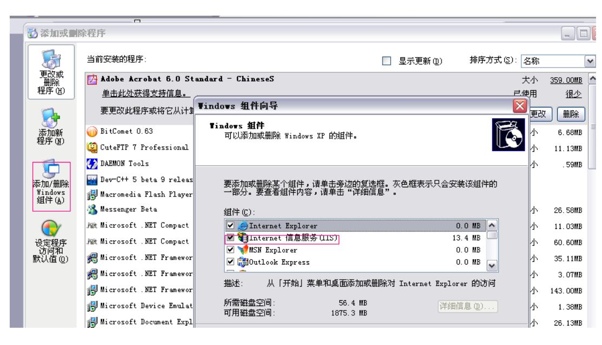
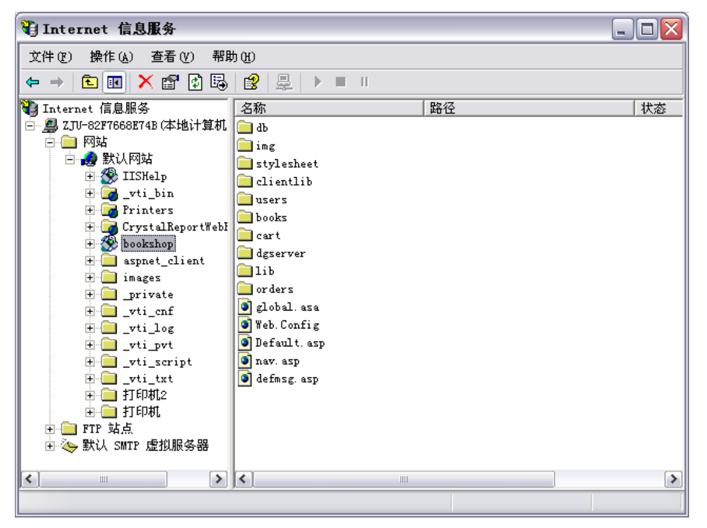
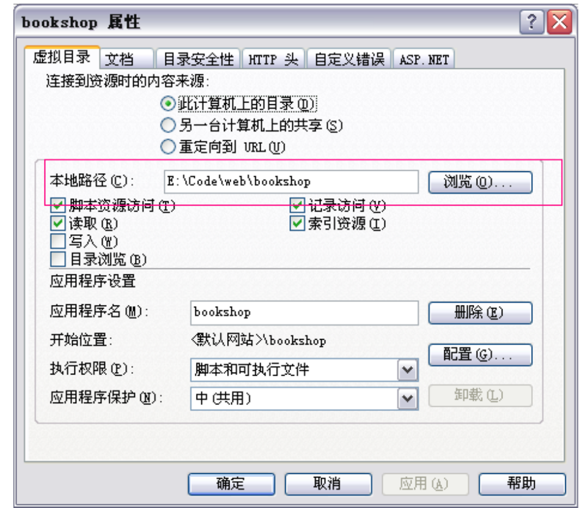

# 第6章: 系统程序的发布

到此,系统的编码工作已经完成,接下来要把它发布到互联网上去,对于网站开发来说这部分的难度并不低于编码的程度,稍有不小心,就会出现许多意想不到的情况。

## 发布的准备

就网站发布和后期维护而言,目前主要存在两种形式,一种是虚拟主机,另一种则是本地架设网站,对于第一种来说,开发者只需要维护文件的更替,用各种 ftp 工具对虚拟主机提供商指定的目录进行操作即可,唯一需要注意的是在购买虚拟主机时,提供商对他所提供的各级产品所支持的组件有详细的说明,当然支持的组件不同,所需要的成本也就不同了,根据自己的需要决定即可,这里就不多加描述了。

如果打算在本地架设网站,则需要做一系列的准备工作,首先,需要确定作为服务器环境的操作系统,然后安装相应的 http 监听程序,最后,还需要根据系统所使用的技术在 http 监听程序上加载各种组件,下面以本系统为例为准备工作做一个
详细的描述。

我们在第四部分已经解释了,对于 ASP 而言,最好的环境是 windows 下的 IIS,在默认情况下,windows 是不安装 IIS 的,需要在“控制面板-添加或删除程序-添加/删除 windows“中手动安装该程序,如下图红框所示:

安装完成后即可得到 IIS 界面,其中 IIS5.5 的界面如下图所示:

最后,看看需要那些组件,在默认情况下 IIS 已经支持了大部分的 ASP 组件,但是如果需要使用一些特殊的功能或者自己写的 ISAPI 程序的话,还需用 Regsvr32 注册相应的 DLL 文件,如,希望提供发送邮件功能的话可以进行如下操作:

- Step1: 将 DLL 文件拷贝至 %SystemRoot%\System32 下;
- Step2: 开始 -> 运行 -> Regsvr32 cdonts.dll;
- Step3: 确认

注,Windows xp, Windows 2003 默认没有附带 CDONTS.DLL,必须手动安装,可以从 Windows 2000 的 system32 中得到该文件,另外,如果需要使用.NET 的话,还需要在系统安装 Microsoft .NET Framework SDK 方可使用。

## 发布的工具

对虚拟主机来说,最原始的方法可以使用 ftp 工具,手动替换更新文件,不过目前的 web 开发工具都提供了站点管理器的功能,他可以根据文件最后修改的时间先后,智能同步本地和远程的文件。

如果是本地架设则只需在 IIS 上建立网站或者虚拟目录并映射到具体的物理目录即可。

## 发布的过程

用 ftp 工具或者网站管理工具上传到虚拟主机的操作都极其简单,这里就不加累述了,下面以本系统为例,对网站的本地架设做个介绍:

因为 windows xp 下的 IIS 只能维持一个网站实例,这里就以虚拟目录代替一个网站(在 windows2003 下可直接另建网站),建立后,打开属性选项卡,如下图所示:

图中红框所示部分,表示网站的实际物理路径,然后使用各种网站管理工具(包括VS2005)在本地服务器上建立 web 开发项目,便可直接在其上对网站进行调试和更改。

## 发布后的维护

网站的运行是一个复杂的过程,时不时会出现一些状况 这时需要分析网站日志来对网站进行修改和重启。这是一个长期而费力的工作。需要专门的训练和学习,这里就不多加描述了。
